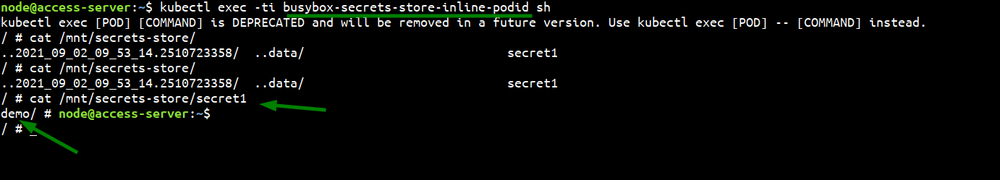

CSI Driver installation

```bash

helm repo add csi-secrets-store-provider-azure https://raw.githubusercontent.com/Azure/secrets-store-csi-driver-provider-azure/master/charts
helm install csi csi-secrets-store-provider-azure/csi-secrets-store-provider-azure --namespace kube-system

```

Installation status

```bash

NAME: csi
LAST DEPLOYED: Thu Sep  2 09:36:55 2021
NAMESPACE: kube-system
STATUS: deployed
REVISION: 1
TEST SUITE: None


```

```bash

Why kube-system

    1. The driver and provider are installed as a DaemonSet with the ability to mount kubelet hostPath volumes and view pod service account tokens. It should be treated as privileged and regular cluster users should not have permissions to deploy or modify the driver.
    2. For AKS clusters with limited egress traffic, installing the driver and provider in kube-system is required to be able to establish connectivity to the kube-apiserver.
    3. The driver pods need to run as root to mount the volume as tmpfs in the pod. Deploying the driver and provider in kube-system will prevent ASC from generating alert "Running containers as root user should be avoided".

```

Prerequisites

    1. azure keyvault

      Create the secret in the name of
        
        secret1 = demo

Require Parameters:

    1. identityResourceID
    2. identityClientID
    3. tenantId

Note: 

    Manage Identity must have provide the access of keyvault service
  
```yaml

# vim aadpodidentity.yaml

apiVersion: aadpodidentity.k8s.io/v1
kind: AzureIdentity
metadata:
  name: csiid
spec:
  type: 0
  resourceID: /subscriptions/xxxxxx-xxxx-xxx-a7f8-xxxxxx/resourceGroups/xxxx-portal-dev/providers/Microsoft.ManagedIdentity/userAssignedIdentities/apg-keyvault
  clientID: xxxxxxx-xxxx-xxxx-xxxx-xxxxxxxx

```

```yaml
# vim aadpodidentitybinding.yaml
apiVersion: aadpodidentity.k8s.io/v1
kind: AzureIdentityBinding
metadata:
  name: csiidbind
spec:
  azureIdentity: csiid
  selector: keyvault

```

```yaml

---
# Create the storage provider class
apiVersion: secrets-store.csi.x-k8s.io/v1alpha1
kind: SecretProviderClass
metadata:
  name: secret-vault-class
spec:
  provider: azure
  parameters:
    keyvaultName: "kv-demoslock-dev"       # The name of the Azure Key Vault
    usePodIdentity: "true"   
    cloudName: ""                          # [OPTIONAL for Azure] if not provided, Azure environment will default to AzurePublicCloud 
    objects:  |
      array:
        - |
          objectName: secret1 
          objectType: secret 
    tenantId: "xxxxxx-xxxxx-xxxxx-xxxx-xxxxx"     # the tenant ID containing the Azure Key Vault instance

```


```yaml
# Demo pod deployment
---
kind: Pod
apiVersion: v1
metadata:
  name: busybox-secrets-store-inline-podid
  labels:
    aadpodidbinding: "keyvault"       
spec:
  containers:
    - name: busybox
      image: k8s.gcr.io/e2e-test-images/busybox:1.29
      command:
        - "/bin/sleep"
        - "10000"
      volumeMounts:
      - name: secrets-store01-inline
        mountPath: "/mnt/secrets-store"
        readOnly: true
  volumes:
    - name: secrets-store01-inline
      csi:
        driver: secrets-store.csi.k8s.io
        readOnly: true
        volumeAttributes:
          secretProviderClass: "secret-vault-class"
```

Output




[Documentation](https://azure.github.io/secrets-store-csi-driver-provider-azure/demos/)
    
[Github Reference](https://github.com/Azure/secrets-store-csi-driver-provider-azure)

[GitHub Workflow](https://github.com/Azure-Samples/secrets-store-csi-with-aks-akv)
